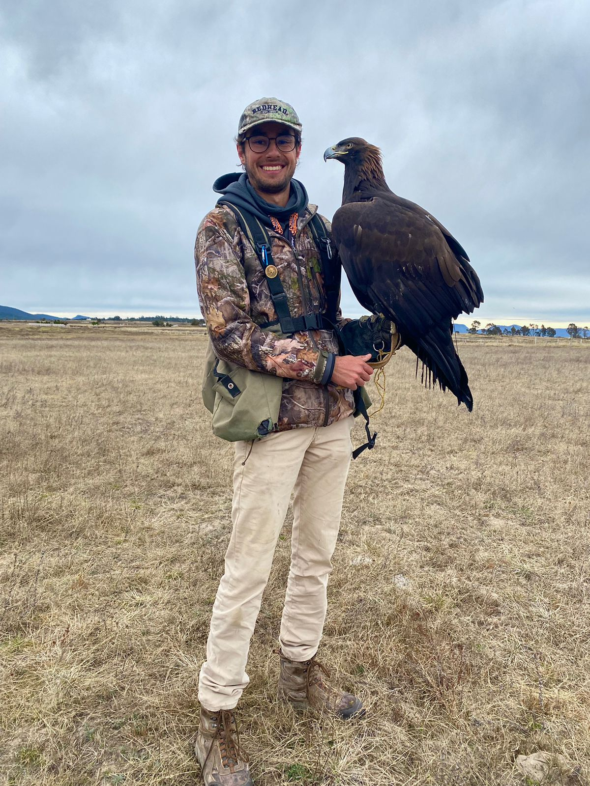

# Un poco sobre mi

Actualmente me encuentro estudiando la
licenciatura en Ciencia de Datos en el prestigioso Instituto Tecnológico
Autónomo de México. Por otro lado, trabajo como administrador de las redes de la universidad.

Mi pasión desde hace mucho tiempo es la cetrería. Este bello arte consiste
en entrenar aves de presa. Creo que me ha enseñado mucho como persona,
desde valorar la naturaleza, hasta impartirme valores. 

Por otro lado, me encanta la música. Desde los 8 años empecé a tomar
clases de piano. Unos cuantos años después me empezó a interesar el “Rock and
Roll”. Esto me llevó a querer aprender a tocar la guitarra eléctrica. Este último
año, tuve la oportunidad de tomar clases con Dimitri Jordania, un profesor
egresado de Berklee. Me encanta el Rock Progresivo.

Desde que tengo memoria siempre me ha gustado ver la NFL. Desde que tengo memoria soy un apasionado fanatico de los Dallas Cowboys. 


Text can be **bold**, _italic_, or ~~strikethrough~~.

[Mejores fotos de caceria](./another-page.html).

There should be whitespace between paragraphs.

There should be whitespace between paragraphs. We recommend including a README, or a file with information about your project.

### Large image


## Header 2

> This is a blockquote following a header.
>
> When something is important enough, you do it even if the odds are not in your favor.

### Header 3

```js
// Javascript code with syntax highlighting.
var fun = function lang(l) {
  dateformat.i18n = require('./lang/' + l)
  return true;
}
```

```ruby
# Ruby code with syntax highlighting
GitHubPages::Dependencies.gems.each do |gem, version|
  s.add_dependency(gem, "= #{version}")
end
```

#### Header 4

*   This is an unordered list following a header.
*   This is an unordered list following a header.
*   This is an unordered list following a header.

##### Header 5

1.  This is an ordered list following a header.
2.  This is an ordered list following a header.
3.  This is an ordered list following a header.

###### Header 6

| head1        | head two          | three |
|:-------------|:------------------|:------|
| ok           | good swedish fish | nice  |
| out of stock | good and plenty   | nice  |
| ok           | good `oreos`      | hmm   |
| ok           | good `zoute` drop | yumm  |

### There's a horizontal rule below this.

* * *

### Here is an unordered list:

*   Item foo
*   Item bar
*   Item baz
*   Item zip

### And an ordered list:

1.  Item one
1.  Item two
1.  Item three
1.  Item four

### And a nested list:

- level 1 item
  - level 2 item
  - level 2 item
    - level 3 item
    - level 3 item
- level 1 item
  - level 2 item
  - level 2 item
  - level 2 item
- level 1 item
  - level 2 item
  - level 2 item
- level 1 item

### Small image


### Large image




### Definition lists can be used with HTML syntax.

<dl>
<dt>Name</dt>
<dd>Godzilla</dd>
<dt>Born</dt>
<dd>1952</dd>
<dt>Birthplace</dt>
<dd>Japan</dd>
<dt>Color</dt>
<dd>Green</dd>
</dl>

```
Long, single-line code blocks should not wrap. They should horizontally scroll if they are too long. This line should be long enough to demonstrate this.
```

```
The final element.
```
