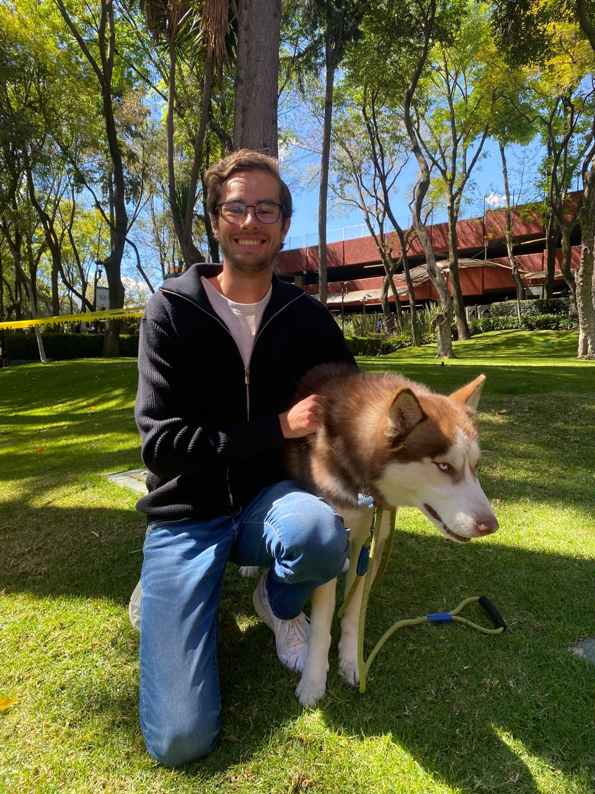

# Un poco sobre mi

Actualmente me encuentro estudiando la
licenciatura en Ciencia de Datos en el prestigioso Instituto Tecnológico
Autónomo de México. Por otro lado, trabajo como administrador de las redes de la universidad.

Mi pasión desde hace mucho tiempo es la cetrería. Este bello arte consiste
en entrenar aves de presa. Creo que me ha enseñado mucho como persona,
desde valorar la naturaleza, hasta impartirme valores. 

Por otro lado, me encanta la música. Desde los 8 años empecé a tomar
clases de piano. Unos cuantos años después me empezó a interesar el “Rock and
Roll”. Esto me llevó a querer aprender a tocar la guitarra eléctrica. Este último
año, tuve la oportunidad de tomar clases con Dimitri Jordania, un profesor
egresado de Berklee. Me encanta el Rock Progresivo.

Desde que tengo memoria siempre me ha gustado ver la NFL. Desde que tengo memoria soy un apasionado fanatico de los Dallas Cowboys. 

[Mejores fotos de caceria](./another-page.html).

